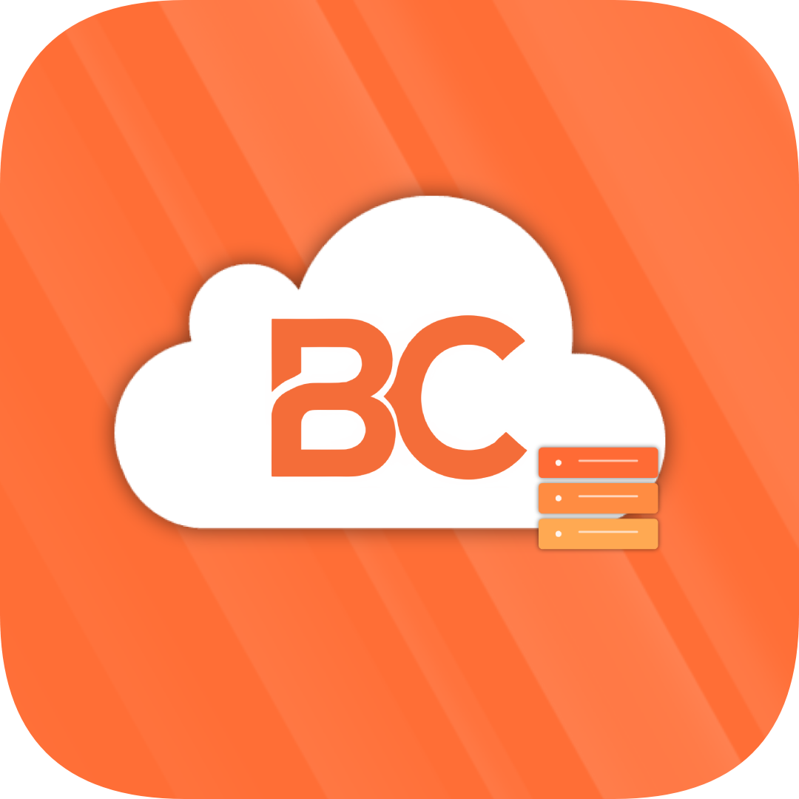
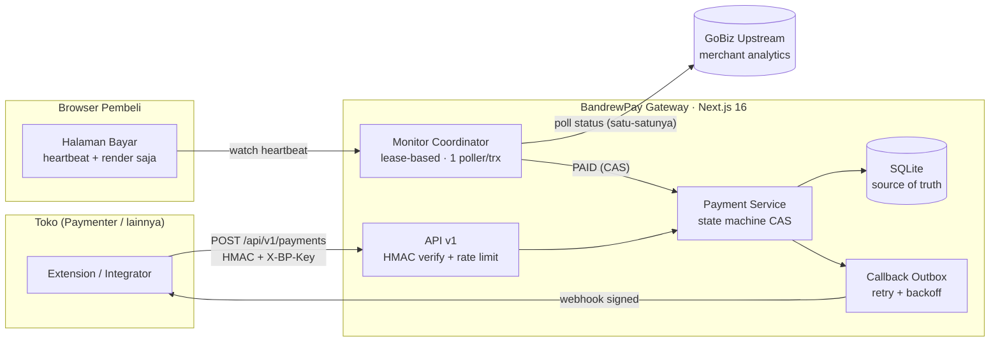
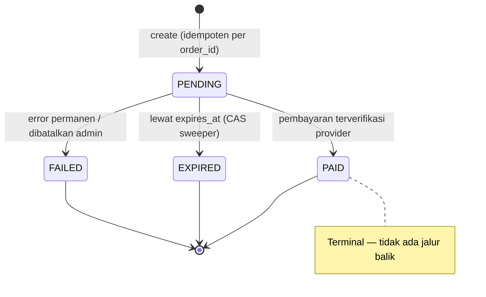
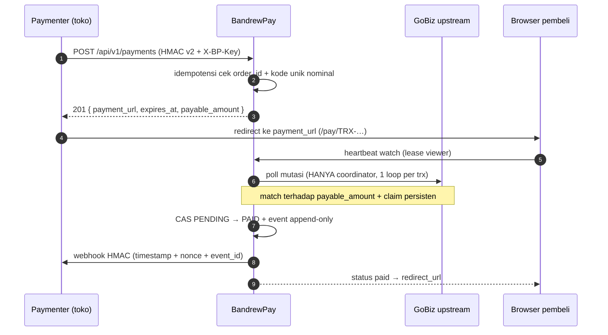

<div align="center">



# ⚡ BandrewPay

**Payment Gateway QRIS self-hosted yang aman, modern, dan production-ready.**

Dynamic QRIS • Server-authoritative • HMAC-signed Webhooks • Dashboard Admin Premium

[](https://nextjs.org)
[](https://react.dev)
[](https://www.typescriptlang.org)
[](https://github.com/WiseLibs/better-sqlite3)

[](#-testing--validasi)
[](#-testing--validasi)
[](#-testing--validasi)
[](#-lisensi)
[](https://t.me/ahmadzakiyo)

</div>

---

> ### 🎯 Kenapa BandrewPay ada?
>
> Gateway QRIS lama berbasis Express menyimpan **semua state di memori** — restart
> server = jendela _double-payment_ terbuka, token merchant telanjang di file
> plaintext, dan tidak ada callback sama sekali.
>
> BandrewPay adalah **rebuild total**: setiap kelemahan lama dianalisis, dipetakan
> sebagai temuan keamanan, lalu dijawab dengan arsitektur baru — SQLite sebagai
> source of truth, klaim pembayaran persisten anti-double-delivery, webhook
> HMAC bertimestamp + anti-replay, dan monitoring lease-based yang melarang
> browser memicu polling provider secara langsung.

---

## 📑 Daftar Isi

- [✨ Fitur Utama](#-fitur-utama)
- [🏗️ Arsitektur](#️-arsitektur)
- [🔄 Alur Pembayaran](#-alur-pembayaran)
- [🔐 Model Keamanan](#-model-keamanan)
- [🚀 Mulai Cepat](#-mulai-cepat)
- [⚙️ Konfigurasi](#️-konfigurasi)
- [📡 API Reference](#-api-reference)
- [🛒 Plugin Paymenter](#-plugin-paymenter)
- [🎛️ Dashboard Admin](#️-dashboard-admin)
- [🧪 Testing & Validasi](#-testing--validasi)
- [🌐 Deploy Produksi](#-deploy-produksi)
- [📁 Struktur Repository](#-struktur-repository)
- [🗺️ Roadmap](#️-roadmap)
- [💬 Kontak & Komunitas](#-kontak--komunitas)
- [📄 Lisensi](#-lisensi)

---

## ✨ Fitur Utama

|     | Fitur                              | Detail                                                                                                                                                                                         |
| --- | ---------------------------------- | ---------------------------------------------------------------------------------------------------------------------------------------------------------------------------------------------- |
| 💳  | **QRIS Dinamis EMVCo**             | Payload dibangun lokal (TLV + CRC16), nominal fleksibel, checksum tervalidasi. PNG dirender _on-the-fly_ dari DB — nol file QRIS di filesystem, nol kiriman payload ke layanan QR pihak ketiga |
| 🔢  | **Kode Unik Nominal**              | Setiap transaksi aktif dapat `payable_amount` unik (+1..100). Dua QRIS aktif **tidak pernah** bernominal sama → mustahil saling klaim di upstream                                              |
| 🛡️  | **Anti Double-Payment**            | Claim ledger persisten di SQLite — restart server **tidak** membuka jendela double-delivery. Transisi status memakai compare-and-set (CAS) dalam satu DB transaction                           |
| 📡  | **Webhook Tersigning**             | Callback keluar dengan `HMAC-SHA256(timestamp.nonce.sha256(body))`, window ±5 menit, nonce anti-replay, dedup via `event_id`, retry backoff otomatis (outbox pattern)                          |
| 👁️  | **Monitoring Lease-Based**         | 100 viewer membuka QR yang sama = **tetap 1 poller** ke provider. Browser tidak pernah memanggil provider langsung — pelindung utama dari ban akun merchant                                    |
| 🎬  | **Halaman Bayar Sinematik**        | Glassmorphism premium: aurora background, kartu 3D tilt, QRIS bercahaya dengan scan aura, centang sukses teranimasi — plus hitung mundur 5 detik sebelum redirect ke toko                      |
| ⏱️  | **Countdown Server-Authoritative** | `expires_at` disimpan UTC di DB. Jam browser dimanipulasi sekalipun → tidak berefek apa pun                                                                                                    |
| 🗄️  | **SQLite Tanpa ORM**               | Skema relasional penuh: FK, partial unique index, prepared statements 100%. Satu file `gateway.db` chmod 600                                                                                   |
| 🎛️  | **Dashboard Admin Premium**        | Glassmorphism halus + Material Design 3: overview, transaksi, callback log, audit log, DB browser aman, pengaturan runtime live-reload                                                         |
| 🔑  | **Multi-Aplikasi**                 | Daftarkan satu aplikasi per platform toko (`APP-xxxx`) — secret sendiri, callback & redirect default sendiri. Toko A tak bisa memvalidasi callback milik toko B                                |
| 🔒  | **Auth Berlapis**                  | scrypt + sesi DB + cookie HttpOnly/SameSite, CSRF double-submit, CSP nonce ketat, rate limit, kunci akun, dan **auto-blokir IP permanen** setelah 3 gagal login                                |
| 🔄  | **Sesi GoBiz Tanpa File**          | Login OTP langsung dari dashboard, sesi tersimpan di SQLite, auto-refresh 6 jam restart-safe, rate-limit OTP 3×/15 menit                                                                       |
| ⚙️  | **Konfigurasi Live**               | Semua setting bisa diubah dari dashboard (**settings DB > env > default**) — interval monitor dibaca ulang tiap siklus, perubahan berlaku tanpa restart                                        |

---

## 🏗️ Arsitektur



### Transisi Status Transaksi



Semua transisi melewati `transitionTransaction()` — compare-and-set + event append-only + audit log, di dalam satu transaksi database.

---

## 🔄 Alur Pembayaran



---

## 🔐 Model Keamanan

| Ancaman                  | Mitigasi                                                                                                                  |
| ------------------------ | ------------------------------------------------------------------------------------------------------------------------- |
| Replay request integrasi | Timestamp ±5 menit + nonce unik tersimpan + HMAC atas `ts.bodyHash`                                                       |
| Webhook palsu ke toko    | Signature per-event + timestamp + `event_id` untuk dedup di sisi toko                                                     |
| Double fulfillment       | Idempotensi create (partial unique index) + claim persisten + CAS status + dedup callback                                 |
| Brute force login admin  | Rate limit per-IP → lockout akun → **blokir IP permanen otomatis** (3 gagal berturut-turut), dikelola di Admin › Keamanan |
| Password bocor via URL   | Form login **selalu POST** — fallback native urlencoded → redirect 303, tidak pernah GET                                  |
| XSS / CSRF di area admin | React escaping + CSP strict nonce + cookie SameSite=Lax + CSRF double-submit untuk semua mutation API                     |
| SQL injection            | 100% prepared statements, tanpa string concatenation                                                                      |
| IDOR pembeli             | Halaman bayar publik by-design (kuitansi) — hanya expose field aman; artifact QR terikat transaksinya                     |
| Secret leak              | Env server-only tervalidasi zod, tanpa `NEXT_PUBLIC_*` rahasia, log tersanitasi, DB browser menyembunyikan hash & secret  |
| Token merchant plaintext | Sesi GoBiz hidup di SQLite (chmod 600), tak pernah dikirim ke klien/log                                                   |

<details>
<summary><b>📐 Rumus signature integrasi (HMAC v2)</b></summary>

```
X-BP-Timestamp: <ms sejak epoch>
X-BP-Nonce:     <string acak unik>
X-BP-Signature: hex(HMAC_SHA256(secret, `${ts}.${nonce}.${sha256hex(rawBody)}`))
X-BP-Key:       APP-xxxx   ← opsional; secret per-aplikasi (multi-toko)
```

Tanpa `X-BP-Key`, request diverifikasi dengan secret global (fallback kompatibilitas).

</details>

---

## 🚀 Mulai Cepat

**Prasyarat:** Node.js ≥ 20 · npm

```bash
# 1. Masuk folder platform & pasang dependency
cd platform
npm install

# 2. Siapkan konfigurasi (WAJIB ganti nilai CHANGE_ME)
cp .env.example .env
nano .env

# 3. Migrasi skema + seed admin pertama
npm run db:migrate
npm run seed

# 4. Jalan!
npm run dev          # http://localhost:4100
```

Login dashboard pertama memakai `ADMIN_USERNAME` / `ADMIN_PASSWORD` dari `.env`
— **segera ganti password** dari _Admin › Pengaturan_ setelah masuk.

**Punya sesi gateway lama?** Impor sekali, tanpa OTP ulang:

```bash
npm run import-session -- /path/ke/.GOPAY_SESI_JANGAN_DIHAPUS.json
```

Perintah lengkap:

| Perintah                     | Fungsi                                                                 |
| ---------------------------- | ---------------------------------------------------------------------- |
| `npm run dev`                | Dev server di `:4100`                                                  |
| `npm run build && npm start` | Production build + serve `:4100`                                       |
| `npm test`                   | Unit test (37 assertions)                                              |
| `npm run smoke`              | E2E penuh: build + boot `:4199` + webhook receiver `:4210` (42 checks) |
| `npm run db:migrate`         | Terapkan migrasi `src/db/schema.*.sql`                                 |
| `npm run seed`               | Seed admin awal (hanya saat DB kosong)                                 |
| `npm run import-session`     | Bootstrap sesi GoBiz dari file legacy                                  |
| `npm run audit:deps`         | Audit kerentanan dependency + cek outdated                             |

---

## ⚙️ Konfigurasi

> **Urutan prioritas: Settings DB › env › default.**
> Semua kunci di bawah (kecuali `DATABASE_PATH` & `GOPAY_SESSION_FILE`) bisa
> dioverride dari _Admin › Pengaturan_, berlaku **tanpa restart**.

| Variabel                            | Default                              | Keterangan                                                                   |
| ----------------------------------- | ------------------------------------ | ---------------------------------------------------------------------------- |
| `APP_URL`                           | `http://localhost:4100`              | Base URL publik — dipakai menyusun `payment_url`                             |
| `SESSION_SECRET`                    | —                                    | Secret penanda tangan sesi admin (min 32 karakter acak)                      |
| `INTEGRATION_SECRET`                | —                                    | Secret integrasi global (fallback); cara resmi: daftar aplikasi di dashboard |
| `ADMIN_USERNAME` / `ADMIN_PASSWORD` | —                                    | Hanya dipakai `npm run seed`                                                 |
| `DATABASE_PATH`                     | `./data/gateway.db`                  | Lokasi SQLite — **env-only**, tak bisa via dashboard                         |
| `GOPAY_MERCHANT_ID`                 | —                                    | ID merchant GoFood Merchant                                                  |
| `GOPAY_SESSION_FILE`                | `../.GOPAY_SESI_JANGAN_DIHAPUS.json` | Sumber bootstrap impor sekali — **env-only**                                 |
| `QRIS_STATIC`                       | —                                    | Template QRIS statis EMVCo (checksum divalidasi; juga bisa via dashboard)    |
| `PAYMENT_TTL_SECONDS`               | `300`                                | Umur transaksi (30..86400)                                                   |
| `MONITOR_POLL_INTERVAL_MS`          | `8000`                               | Interval poll provider — **jangan diturunkan** (anti-ban)                    |
| `MONITOR_VIEWER_LEASE_MS`           | `25000`                              | Masa hidup lease viewer                                                      |
| `CALLBACK_TIMEOUT_MS`               | `10000`                              | Timeout pengiriman webhook                                                   |

---

## 📡 API Reference

Envelope respons selalu `{ "success": boolean, ... }` — kontrak yang sama dengan integrator lama.

### Buat Pembayaran

```http
POST /api/v1/payments
Content-Type: application/json
X-BP-Timestamp: 1756166400000
X-BP-Nonce: 8f14e45f-ea09-…
X-BP-Key: APP-a1b2c3d4          ← opsional (multi-aplikasi)
X-BP-Signature: <hex HMAC v2>

{
  "order_id": "INV-1024",
  "amount": 50000,
  "customer_name": "Budi",
  "customer_email": "budi@mail.com",
  "callback_url": "https://toko.com/extensions/bandrewpay/webhook",
  "redirect_url": "https://toko.com/thanks"
}
```

**201 Created**

```json
{
  "success": true,
  "data": {
    "transaction_id": "TRX-…",
    "order_id": "INV-1024",
    "amount": 50000,
    "payable_amount": 50037,
    "status": "pending",
    "payment_url": "https://pay.domainmu.com/pay/TRX-…",
    "expires_at": "2026-08-26T12:05:00.000Z"
  }
}
```

> Request `order_id` sama saat masih `PENDING` → mengembalikan transaksi yang sama (HTTP 200), bukan duplikat.

### Cek Status (server-to-server)

```http
GET /api/v1/payments/{transaction_id}     ← header HMAC identik
```

### Endpoint Lainnya

| Endpoint                        | Auth        | Fungsi                                                                |
| ------------------------------- | ----------- | --------------------------------------------------------------------- |
| `GET /pay/{trxId}`              | publik      | Halaman bayar pembeli                                                 |
| `GET /api/pay/{id}/qr.png`      | publik      | Gambar QRIS dirender on-the-fly                                       |
| `GET /api/payments/{id}/status` | publik      | Status + `server_now_ms` untuk koreksi countdown                      |
| `POST /api/payments/watch`      | publik      | Heartbeat lease viewer                                                |
| `GET /api/health`               | publik      | Health check (untuk proxy/WAF uptime)                                 |
| `/api/admin/*`                  | sesi + CSRF | Dashboard API (login, settings, apps, provider, security, db-browser) |

### Webhook Keluar (ke toko)

Dikirim saat transaksi `PAID`, ditandatangani dengan **secret aplikasi** transaksi tersebut:

```
X-BP-Timestamp / X-BP-Nonce / X-BP-Signature
{ "event_id": "<uuid>", "order_id": "...", "transaction_id": "TRX-…",
  "status": "paid", "amount": 50000, "paid_at": "..." }
```

Gagal dikirim? Outbox mencoba ulang dengan backoff — terpantau di _Admin › Callback_.

---

## 🛒 Plugin Paymenter

Official extension di [`paymenter-plugin/BandrewPay/`](paymenter-plugin/BandrewPay/) — v1.1.0.

1. Salin folder `BandrewPay/` ke `extensions/` instalasi Paymenter Anda.
2. Aktifkan **BandrewPay** dari admin Paymenter → Extensions.
3. Isi konfigurasi:

| Field                       | Keterangan                                                                 |
| --------------------------- | -------------------------------------------------------------------------- |
| URL Gateway BandrewPay      | Base URL platform (mis. `https://pay.domainmu.com`)                        |
| Integration Secret          | Secret aplikasi dari _BandrewPay › Aplikasi_ (disarankan), min 32 karakter |
| ID Aplikasi (X-BP-Key)      | `APP-xxxx` untuk multi-aplikasi; kosongkan untuk secret global lama        |
| Redirect Link Setelah Bayar | Opsional — kosong = otomatis ke invoice Paymenter                          |
| URL Paymenter               | Opsional — kosong untuk auto-detect                                        |

Alur: invoice dibuat → plugin POST create (signed) → buyer dibuka `payment_url` →
terdeteksi paid → webhook signed menandai invoice lunas. Detail lengkap di
[README plugin](paymenter-plugin/BandrewPay/README.md).

---

## 🎛️ Dashboard Admin

| Halaman             | Fungsi                                                                              |
| ------------------- | ----------------------------------------------------------------------------------- |
| **Overview**        | Statistik ringkas + status sistem                                                   |
| **Transaksi**       | Daftar + filter, detail per-transaksi dengan timeline event append-only, aksi admin |
| **Callback**        | Log pengiriman webhook + status retry outbox                                        |
| **Database**        | Browser entri DB yang aman (hash password & secret tidak pernah ikut ter-serialize) |
| **Pembayaran Baru** | Buat transaksi manual dari dashboard                                                |
| **Sesi GoPay**      | Login OTP merchant, refresh token manual, status auto-refresh                       |
| **Aplikasi**        | CRUD aplikasi integrasi multi-toko — secret tampil **sekali** saat dibuat/dirotasi  |
| **Keamanan**        | Blokir IP manual/permanen, daftar blokir otomatis, buka blokir                      |
| **Pengaturan**      | Semua konfigurasi runtime + sumber nilainya (settings/env/default) + ganti password |

---

## 🧪 Testing & Validasi

```bash
cd platform
npm test           # 37 unit tests  ✓
npm run smoke      # 42 e2e checks  ✓ (build + boot + webhook receiver sungguhan)
npm run audit:deps # npm audit → 0 vulnerabilities
```

Cakupan smoke test: auth HMAC (signature salah/basi/replay nonce ditolak),
idempotensi create, kode unik nominal, rendering halaman + QR, lease watcher,
login & CSRF admin, settings override, OTP guard tanpa sentuh upstream,
multi-aplikasi (create per-app secret, app nonaktif/dihapus), fallback form POST,
auto-blokir IP, callback HMAC end-to-end sampai receiver lokal, expired → 410.

---

## 🌐 Deploy Produksi

Platform adalah **aplikasi Node tunggal** — taruh di belakang reverse proxy apa pun.

<details>
<summary><b>Nginx (recommended)</b></summary>

```nginx
location / {
    proxy_pass http://127.0.0.1:4100;
    proxy_set_header Host $host;
    proxy_set_header X-Forwarded-For $proxy_add_x_forwarded_for;
    proxy_set_header X-Real-IP $remote_addr;
    proxy_set_header X-Forwarded-Proto $scheme;
}
```

</details>

<details>
<summary><b>PM2 / Docker / cPanel</b></summary>

```bash
# PM2
cd platform && npm run build && pm2 start "npm start" --name bandrewpay

# Docker (image Node 20+, mount volume untuk platform/data/)
docker run -d --name bandrewpay \
  -v $PWD/platform/data:/app/platform/data \
  --env-file platform/.env -p 4100:4100 bandrewpay
```

cPanel: buat Node.js App, startup `node_modules/next/dist/bin/next` dengan argumen
`start`, atau pakai custom wrapper script. CloudLinux wajib Node ≥ 18.

</details>

**Checklist go-live:** ganti semua `CHANGE_ME_*` ✓ · HTTPS di proxy ✓ ·
`APP_URL` = domain publik ✓ · login OTP merchant via _Sesi GoPay_ ✓ ·
ganti password admin ✓ · `npm run smoke` hijau sebelum & sesudah deploy ✓

Kompatibilitas WAF/reverse-proxy: app hanya butuh header standar
`X-Forwarded-For`/`X-Real-IP` untuk deteksi IP; health check di `/api/health`;
tanpa WebSocket; timeout outbound dibatasi sehingga tidak menggantung proxy.

---

## 📁 Struktur Repository

```
📦 .
├── 📂 platform/                  # ⭐ BandrewPay — platform utama (Next.js 16)
│   ├── src/
│   │   ├── app/                  # App Router: /pay, /api/v1, /api/admin, dashboard
│   │   ├── lib/
│   │   │   ├── payments/         # service, state machine, verifier, QRIS+CRC16, provider
│   │   │   ├── auth/             # scrypt, session, admin guard, IP guard
│   │   │   ├── callbacks/        # dispatcher + outbox retry
│   │   │   ├── monitor/          # coordinator lease-based polling
│   │   │   └── …                 # hmac, integration-auth, config-store, rate-limit, audit
│   │   └── db/schema.*.sql       # migrasi (001 core → 004 ip_blocks)
│   ├── scripts/                  # migrate, seed, import-session, smoke
│   ├── tests/unit/               # 7 suite unit test
│   ├── docs/ARCHITECTURE.md      # 📖 keputusan arsitektur + analisis migrasi
│   └── data/gateway.db           # (gitignored) SQLite production
├── 📂 paymenter-plugin/
│   └── BandrewPay/               # Extension resmi Paymenter v1.1.0
├── 📂 reference/                 # Gateway Express legacy — porting reference/fallback saja
├── 📂 .opencode/skills/          # Knowledge base agent (arsitektur, debugging, security…)
├── AGENTS.md                     # Aturan kerja agent untuk repo ini
├── CHANGELOG.md                  # Catatan perubahan (Keep a Changelog)
└── LICENSE                       # Software License Agreement
```

---

## 🗺️ Roadmap

- [ ] CI GitHub Actions (unit + smoke + audit pada setiap push)
- [ ] Notifikasi Telegram/Laravel queue untuk event pembayaran
- [ ] Ekspor laporan transaksi (CSV)
- [ ] Mode multi-instance (koordinasi lease lintas mesin)
- [ ] Halaman status publik (uptime + insiden)

---

## 📄 Lisensi

Didistribusikan di bawah [SOFTWARE LICENSE AGREEMENT](LICENSE) —
© BandrewPay / BandrewCloud. Penggunaan, modifikasi, dan redistribusi
mengikuti ketentuan pada berkas lisensi.

<div align="center">
<sub>Dibangun dengan ⚡ oleh BandrewCloud — secure by design, server-authoritative, production-ready.</sub>
</div>
